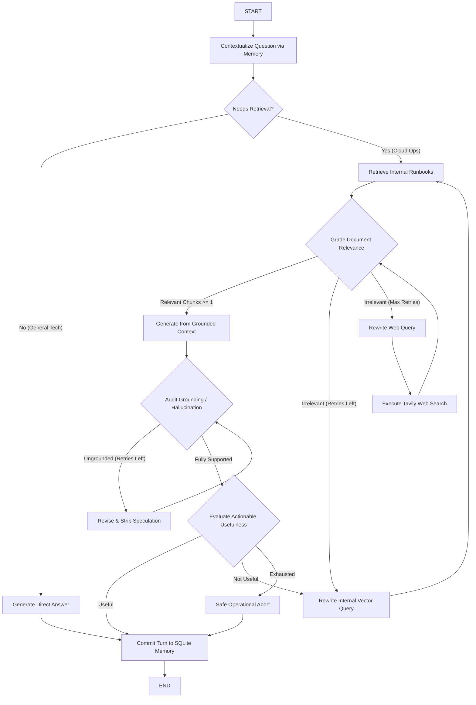

# 🛡️ CloudOps Sentinel — Enterprise Incident Response Self-RAG Copilot

[](https://www.python.org/downloads/)
[](https://fastapi.tiangolo.com)
[](https://langchain-ai.github.io/langgraph/)
[](https://www.pinecone.io/)
[](https://openai.com/)
[](https://vitejs.dev/)
[](LICENSE)

**CloudOps Sentinel** is an enterprise-grade, agentic **Self-Reflective Retrieval-Augmented Generation (Self-RAG)** system built for cloud site reliability engineers (SREs), DevOps teams, and incident response personnel.

Unlike conventional RAG pipelines that blindly retrieve chunks and naively generate responses, CloudOps Sentinel uses a cyclical **LangGraph state machine** to dynamically reflect on retrieval necessity, self-grade chunk relevance, rewrite ambiguous queries, audit factual grounding to prevent hallucinations, and fall back to external web search when internal runbooks are insufficient.

---

## 📑 Table of Contents

- [The High-Stakes Problem](#-the-high-stakes-problem)
- [Why Self-RAG?](#-why-self-rag)
- [System Architecture](#-system-architecture)
- [Key Features](#-key-features)
- [Included Operational Runbooks](#-included-operational-runbooks)
- [Project Directory Structure](#-project-directory-structure)
- [Quick Start Guide](#-quick-start-guide)
  - [1. Prerequisites](#1-prerequisites)
  - [2. Environment Configuration](#2-environment-configuration)
  - [3. Backend Installation & Runbook Ingestion](#3-backend-installation--runbook-ingestion)
  - [4. Frontend Installation & Dashboard Launch](#4-frontend-installation--dashboard-launch)
  - [5. Running with Docker](#5-running-with-docker)
- [API Reference](#-api-reference)
- [Self-RAG Decision Nodes Breakdown](#-self-rag-decision-nodes-breakdown)
- [Enterprise Evaluation & Benchmark Suite (DeepEval & Ragas)](#-enterprise-evaluation--benchmark-suite)
- [Observability & Audit Trail](#-observability--audit-trail)
- [License](#-license)

---

## 🚨 The High-Stakes Problem

During severe production outages (P0/P1 incidents), operational decisions must be fast, precise, and 100% grounded in verified Standard Operating Procedures (SOPs):

- **Hallucinated remediation commands** (such as executing incorrect database migrations or destructive Kubernetes rollouts) can turn a minor microservice degradation into a catastrophic multi-region outage.
- **Noisy vector matches** inject irrelevant context from unrelated services into LLM prompts, leading to confusing or dangerous advice.
- **Static knowledge limitations**: When internal documentation is missing or outdated, standard RAG systems hit a dead end rather than intelligently searching live provider status pages or official documentation.

---

## 🧠 Why Self-RAG?

CloudOps Sentinel integrates self-reflection at every phase of the incident response lifecycle:

```
                      ┌──────────────────────────────────────┐
                      │        User Incident Question        │
                      └──────────────────┬───────────────────┘
                                         │
                                         ▼
                      ┌──────────────────────────────────────┐
                      │    1. Contextualize with History     │
                      └──────────────────┬───────────────────┘
                                         │
                                         ▼
                      ┌──────────────────────────────────────┐
                      │    2. Adaptive Retrieval Decision    │
                      └──────────┬───────────────────┬───────┘
                       [Needs    │                   │ [Generic
                        Runbook] │                   │  Trivia]
                                 ▼                   ▼
                 ┌───────────────────────┐   ┌───────────────────────┐
                 │  3. Pinecone Vector   │   │  Direct LLM Response  │
                 │      Retrieval        │   │  (No DB Querying)     │
                 └──────────┬────────────┘   └───────────┬───────────┘
                            │                            │
                            ▼                            │
                 ┌───────────────────────┐               │
                 │ 4. Relevance Grading  │               │
                 └────┬────────────┬─────┘               │
            [Relevant]│            │[Irrelevant]         │
                      │            ▼                     │
                      │   ┌──────────────────┐           │
                      │   │ 5. Query Rewrite │           │
                      │   └──┬─────────────┬─┘           │
                      │[Retry]│             │[Exhausted]  │
                      │       ▼             ▼             │
                      │  (Pinecone)   (Tavily Web Search) │
                      │                     │             │
                      ▼                     ▼             │
                 ┌──────────────────────────────┐         │
                 │ 6. Grounded Answer Synthesis │         │
                 └──────────────┬───────────────┘         │
                                │                         │
                                ▼                         │
                 ┌──────────────────────────────┐         │
                 │  7. Grounding Audit Check    │         │
                 │    (Hallucination Filter)    │         │
                 └──────┬───────────────────────┘         │
            [Supported] │   [Ungrounded]                  │
                        │        │                        │
                        │        ▼                        │
                        │ ┌─────────────────────────┐     │
                        │ │ 8. Revise & Strip Claims│     │
                        │ └──────────────┬──────────┘     │
                        │                │ (Re-audit)     │
                        ▼◄───────────────┘                │
                 ┌──────────────────────────────┐         │
                 │  9. Actionable Usefulness    │         │
                 └──────────────┬───────────────┘         │
                                │                         │
                                ▼                         ▼
                 ┌───────────────────────────────────────────────┐
                 │  10. Commit to Memory & Return Audit Result   │
                 └───────────────────────────────────────────────┘
```

---

## 🏛️ System Architecture

### LangGraph State Machine



---

## ✨ Key Features

- **Adaptive Retrieval**: Skips costly vector similarity search for trivial inquiries and prioritizes authoritative internal SOPs for cloud operations.
- **Pinecone Serverless Vector Store**: Fast, scalable cosine similarity search partitioned by namespace (`incident-runbooks`) using OpenAI's `text-embedding-3-large` (3072 dimensions).
- **Document Self-Grading**: LLM acts as an operational judge, discarding noise and keeping only chunks that directly inform incident troubleshooting.
- **Iterative Query Rewriting**: Translates raw operator queries containing jargon into keyword-dense embeddings representations.
- **Autonomous Web Fallback via Tavily**: When internal runbooks lack documentation for third-party cloud incidents (e.g., AWS service disruptions or Stripe API degradations), the system queries live web evidence.
- **Hallucination Prevention**: Performs explicit claim-by-claim verification (`check_support`), looping back to `revise_answer` if ungrounded recommendations appear.
- **Multi-Turn Incident Memory**: Checkpoints session history via `SqliteSaver`, allowing engineers to ask follow-up questions (e.g., *"What were the rollback commands again?"* or *"Apply that to pod 3"*).
- **Comprehensive Audit Trail**: Every Q&A turn records latency, confidence scores, routing verdicts, and execution traces in Neon Serverless PostgreSQL via SQLAlchemy.
- **Interactive Fullstack Dashboard**: Modern React + Vite frontend with real-time graph step visualization, drag-and-drop document upload, and audit inspection.

---

## 📚 Included Operational Runbooks

The repository includes pre-built incident response runbooks in [`documents/`](file:///d:/Agentic%20AI%20Projects/FDE%20Projects/cloudops-sentinental/documents):

1. **`checkout-api-runbook.md`**:
   - Symptoms: HTTP 502/504 surges, connection pool exhaustion, circuit breaker trips.
   - Remediation: Upstream health verification, connection pool increases, manual circuit breaker reset procedures.
2. **`payments-high-cpu-runbook.md`**:
   - Symptoms: CPU throttling, JVM garbage collection pauses, thread pool starvation.
   - Remediation: Thread dump capture, HPA horizontal pod autoscaling overrides, memory leak mitigations.
3. **`deployment-rollback-sop.md`**:
   - Symptoms: Critical canary regressions, failed database migrations, crash-looping replicas.
   - Remediation: Zero-downtime Helm rollback, blue/green traffic redirection, post-rollback smoke tests.

---

## 📂 Project Directory Structure

```plaintext
cloudops-sentinental/
├── backend/                    # FastAPI, LangGraph & Pinecone backend service
│   ├── app.py                  # FastAPI REST application entrypoint
│   ├── data_ingestion.py       # CLI script for bulk embedding & Pinecone indexing
│   ├── requirements.txt        # Python dependencies
│   ├── Dockerfile              # Containerized deployment specification
│   ├── flow.md                 # Self-RAG logic flow diagram
│   ├── .env.example            # Backend environment variables template
│   ├── documents/              # Operational runbooks & incident SOPs
│   │   ├── checkout-api-runbook.md
│   │   ├── deployment-rollback-sop.md
│   │   └── payments-high-cpu-runbook.md
│   ├── src/                    # Core Python modules
│   │   ├── __init__.py
│   │   ├── config.py           # Pydantic Settings & environment validation
│   │   ├── db.py               # SQLite audit trail & logging helpers
│   │   ├── ingestion.py        # Multi-format doc parsing (PDF, MD, DOCX) & chunking
│   │   ├── models.py           # Pydantic REST API request/response schemas
│   │   ├── self_rag.py         # LangGraph Self-RAG state machine & decision nodes
│   │   └── vectorstore.py      # Pinecone serverless vector index client
│   ├── docs/                   # Architecture diagrams & visuals
│   └── data/                   # Local SQLite state (audit.db & session memory)
├── frontend/                   # React + Vite interactive operator dashboard
│   ├── src/
│   │   ├── components/         # ChatView, AuditsView, SourcesViewer, Visualizer
│   │   ├── services/api.ts     # Axios API service
│   │   ├── types.ts            # TypeScript interfaces
│   │   └── App.tsx
│   ├── package.json
│   └── vite.config.ts
├── .gitignore                  # Global repository git ignore
├── LICENSE                     # MIT License
└── README.md                   # Project documentation
```

---

## 🚀 Quick Start Guide

### 1. Prerequisites

- **Python**: Version 3.10, 3.11, or 3.12
- **Node.js**: Version 18+ (for frontend dashboard)
- **API Keys**:
  - [OpenAI API Key](https://platform.openai.com/)
  - [Pinecone API Key](https://www.pinecone.io/)
  - [Tavily API Key](https://tavily.com/) (for fallback internet search)
  - [LangSmith API Key](https://smith.langchain.com/) *(optional, for observability)*

---

### 2. Environment Configuration

Navigate to the `backend` directory, copy the example environment file, and configure your credentials:

```bash
cd backend
cp .env.example .env
```

Open `backend/.env` and fill in your keys:

```ini
# OpenAI Model & Embeddings
OPENAI_MODEL=gpt-4o-mini
EMBEDDING_MODEL=text-embedding-3-large
EMBEDDING_DIMENSION=3072
OPENAI_API_KEY=sk-...

# Pinecone Serverless Vector Store
PINECONE_INDEX_NAME=cloudops-sentinel-openai-self-rag
PINECONE_NAMESPACE=incident-runbooks
PINECONE_API_KEY=pcsk_...
PINECONE_CLOUD=aws
PINECONE_REGION=us-east-1

# Tavily Internet Search (Fallback)
TAVILY_API_KEY=tvly-...

# Self-RAG Graph Controls
TOP_K=5
MAX_SUPPORT_RETRIES=2
MAX_RETRIEVAL_REWRITES=2
MAX_WEB_REWRITES=2
DATABASE_PATH=data/audit.db

# LangSmith Tracing (Optional)
LANGSMITH_TRACING=true
LANGSMITH_ENDPOINT=https://api.smith.langchain.com
LANGSMITH_API_KEY=lsv2_...
LANGSMITH_PROJECT=cloudops-sentinel
```

---

### 3. Backend Installation & Runbook Ingestion

From the `backend` directory:

1. **Create and activate a virtual environment**:
   ```bash
   python -m venv .venv
   # Windows:
   .venv\Scripts\activate
   # macOS/Linux:
   source .venv/bin/activate
   ```

2. **Install Python dependencies**:
   ```bash
   pip install -r requirements.txt
   ```

3. **Ingest the operational runbooks into Pinecone**:
   ```bash
   python data_ingestion.py
   ```
   *This automatically provisions the Pinecone serverless index with 3072 dimensions, chunks the documents in `documents/`, and creates idempotent vector embeddings.*

4. **Launch the FastAPI application**:
   ```bash
   python app.py
   ```
   *The backend starts at `http://localhost:8080` with interactive Swagger docs at `http://localhost:8080/docs`.*

---

### 4. Frontend Installation & Dashboard Launch

1. **Navigate to the frontend directory**:
   ```bash
   cd frontend
   ```

2. **Install Node packages**:
   ```bash
   npm install
   ```

3. **Start the development server**:
   ```bash
   npm run dev
   ```
   *Open `http://localhost:5173` in your browser to access the interactive incident response dashboard.*

---

### 5. Running with Docker

Build and run the backend using Docker:

```bash
# Build Docker image
docker build -t cloudops-sentinel:latest .

# Run container with environment file
docker run -d --name cloudops-sentinel -p 8080:8080 --env-file .env cloudops-sentinel:latest
```

---

## 📡 API Reference

### 1. `POST /api/chat`
Submit an incident question or follow-up query to the Self-RAG pipeline.

**Request Body:**
```json
{
  "question": "Checkout API is returning 504 Gateway Timeout. What immediate actions should I take?",
  "thread_id": "incident-2026-0925-01"
}
```

**Response Body:**
```json
{
  "answer": "1. Verify upstream downstream payment gateway latency.\n2. Scale the connection pool to 150 connections.\n3. If circuit breaker is OPEN, trigger manual reset via /internal/circuit-breaker/reset.",
  "route": "Private Runbooks",
  "used_web_search": false,
  "support_status": "fully_supported",
  "usefulness": "useful",
  "sources": [
    {
      "type": "internal",
      "title": "checkout-api-runbook.md",
      "source": "documents/checkout-api-runbook.md",
      "url": null,
      "page": null
    }
  ],
  "trace": [
    "Memory: new incident session initialized",
    "Retrieval decision: True",
    "Internal Pinecone retrieval: 5 chunks matched",
    "Relevance grading (internal): 3/5 chunks approved",
    "Generated answer from internal evidence",
    "Support / Grounding audit: fully_supported",
    "Usefulness evaluation: useful",
    "SQLite memory checkpoint updated"
  ],
  "thread_id": "incident-2026-0925-01",
  "memory_turns": 1
}
```

### 2. `POST /api/upload`
Upload custom SOP or runbook documents (PDF, Markdown, TXT, DOCX) to index them into Pinecone on the fly.

### 3. `GET /api/audits?limit=25`
Retrieve historical incident queries, execution paths, confidence ratings, and routing decisions.

### 4. `GET /api/health`
Health check endpoint reporting service availability.

---

## 🔍 Self-RAG Decision Nodes Breakdown

Every node in [`src/self_rag.py`](file:///d:/Agentic%20AI%20Projects/FDE%20Projects/cloudops-sentinental/src/self_rag.py) is documented with strict type annotations:

| Node Name | Function | Decision / Action Performed |
|---|---|---|
| `contextualize` | `contextualize_question` | Rewrites pronouns and incident context using past chat history. |
| `decide_retrieval` | `decide_retrieval` | Determines whether internal runbooks are needed vs direct knowledge. |
| `direct` | `generate_direct` | Generates direct conceptual answers without touching the vector database. |
| `retrieve` | `retrieve_internal` | Queries Pinecone for top-$k$ runbook chunks based on cosine similarity. |
| `grade` | `grade_relevance` | Filters candidate chunks, dropping noise and retaining relevant evidence. |
| `rewrite_internal` | `rewrite_internal_query` | Enriches query with operational synonyms when initial matches fail. |
| `rewrite_web` | `rewrite_web_query` | Prepares an internet-optimized search query when internal docs are silent. |
| `web_search` | `web_search` | Fetches live third-party technical documentation via the Tavily API. |
| `generate` | `generate_from_context` | Synthesizes actionable remediation instructions strictly from evidence. |
| `support` | `check_support` | Audits factual grounding to detect and prevent LLM hallucinations. |
| `revise` | `revise_answer` | Self-correction loop: rewrites the answer to strip unsupported speculation. |
| `usefulness` | `check_usefulness` | Validates that the answer directly resolves the incident question. |
| `no_answer` | `no_answer` | Safe operational abort if neither internal nor external evidence is reliable. |
| `commit_memory` | `commit_memory` | Checkpoints the exchange to SQLite for multi-turn conversational recall. |

---

## 🎯 Enterprise Evaluation & Benchmark Suite (DeepEval & Ragas)

CloudOps Sentinel features an automated evaluation and red-teaming framework measuring **20+ production metrics** across **6 distinct evaluation categories**, validated against a **62-item Golden Dataset** (`backend/evals/golden_dataset.json`).

For full architectural documentation, see [`backend/evals/README.md`](backend/evals/README.md).

### Evaluation Categories & Metrics:

```
┌──────────────────────────────────────────────────────────────────────────────────┐
│                      CLOUDOPS SENTINEL EVALUATION MATRIX                         │
├─────────────────────────┬────────────────────────────────────────────────────────┤
│ 1. RAG Triad & CRAG     │ AnswerRelevancy, Faithfulness, ContextualRelevancy,    │
│                         │ ContextualPrecision, ContextualRecall                  │
├─────────────────────────┼────────────────────────────────────────────────────────┤
│ 2. Conversational RAG   │ TurnRelevancy, TurnFaithfulness, TurnContextPrecision, │
│                         │ TurnContextRecall, ConversationCompleteness, Retention │
├─────────────────────────┼────────────────────────────────────────────────────────┤
│ 3. Safety & Guardrails  │ Bias, Toxicity, NonAdvice, Misuse, PIILeakage, Role    │
├─────────────────────────┼────────────────────────────────────────────────────────┤
│ 4. Agentic & Behavioral │ ToolUse, GoalAccuracy, PromptAlignment, TopicAdherence │
├─────────────────────────┼────────────────────────────────────────────────────────┤
│ 5. Summarization        │ Summarization (Alignment + Inclusion), Hallucination   │
├─────────────────────────┼────────────────────────────────────────────────────────┤
│ 6. Ragas Benchmark      │ Faithfulness, Answer Relevancy, Precision, Recall      │
└─────────────────────────┴────────────────────────────────────────────────────────┘
```

### Running Evaluations via Super Runner CLI:

```powershell
cd backend

# Execute all evaluation categories sequentially (Unified Executive Dashboard)
python -m evals.run_all_evals --category all --samples 3

# Execute by specific category
python -m evals.run_all_evals --category rag --samples 5
python -m evals.run_all_evals --category conversational --samples 2
python -m evals.run_all_evals --category safety --samples 4
python -m evals.run_all_evals --category agentic --samples 3
python -m evals.run_all_evals --category summarization --samples 2
python -m evals.run_all_evals --category ragas --samples 3
```

---

## 📊 Observability & Audit Trail

Incident transparency is paramount. CloudOps Sentinel provides two layers of observability:

1. **Local SQLite Audit Database (`data/audit.db`)**: Every single query, route taken, retrieved sources, hallucination rating, and breadcrumb trace is recorded for post-incident review.
2. **LangSmith Integration**: When `LANGSMITH_TRACING=true` is enabled, LangGraph automatically streams detailed execution graphs, token latencies, and tool evaluations to your LangSmith project.

---

## 📄 License

This project is licensed under the [MIT License](LICENSE).
